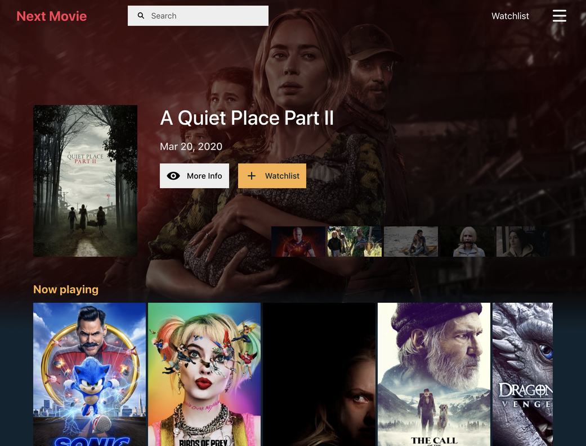

  

# [Next Movie](https://nextmovie.us)

Find and save the movies that you want to watch.

## Contributing

Contributions are heartily welcomed.

### Codebase

Next Movie is built as a full-stack JavaScript application. This repository contains the main frontend logic. Please also consider contributing to the design system [next-movie-components](https://github.com/dannysindra/next-movie-components) and to the GraphQL API [next-movie-api](https://github.com/dannysindra/next-movie-api).

#### Technologies

List of main technologies used in this repository:

- **ReactJS**: UI library
- **Apollo**: GraphQL client
- **Firebase**: Authentication and data store
- **Travis**: Continuous deployment

#### Code Style

You may code in any style you prefer, and it will automatically be formatted by Prettier when you run `git commit`.
